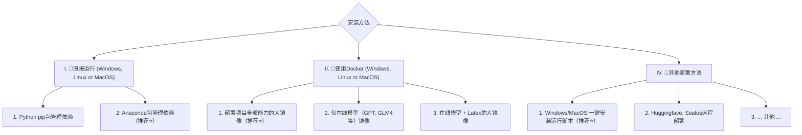

> [Whta`s News]
>
> 1. 🔌 支持提取测试点、文档转测试用例、接口文档转测试用例、测试用例检查优化、文档需求分析问答等等插件
> 2. 📚 支持GUI知识库构建、问答、生成摘要、FastApi知识库构建、问答、生成摘要
> 3. 🔗 支持飞书文档、飞书项目、金山文档、QQ文档等云文档链接解析
> 4. 👓 支持docx2md、pdf2md、excel2md、xmind2md、img2vision、img/2ocr，几乎主流文档的读取，并最大程度转换格式
> 5. 🚀 支持通过Json自定义插件流程
> 6. 🔍 支持Prompt、Mask（自定义对话）管理、复用
> 7. 🧩 支持通过Prompt形式使用mermaid api 绘制各种图表

<div align=center>
<h1 aligh="center">
 Hello GPT
</h1>首先，感谢以下几位大佬的开源项目，如果没有xxx，就没有xxx（此处省略一万字）
如果你喜欢这个项目，麻烦一键（给我一个Satr）三连（下面的项目三连Star）！🙇🙇🙇🙇
</div
> 特别鸣谢（插件+代码基座）：[binary-husky/gpt_academic](https://github.com/binary-husky/gpt_academic)
>
> 前端（Gradio+js）：[GaiZhenbiao/ChuanhuChatGPT](https://github.com/GaiZhenbiao/ChuanhuChatGPT)
>
> 知识库功能（Knowledge Base+FastApi）：[chatchat-space/Langchain-Chatchat](https://github.com/chatchat-space/Langchain-Chatchat)

# 项目介绍

基于`学术优化项目`优秀的**插件**能力，期望完成一系列Ai赋能测试（偷懒）的解决方案。

适配`Chuanhu、Keldos` 项目巨巨巨好看的前端，支持对话管理，用的舒心。

适配`Chatchat`项目巨巨巨牛逼的知识库管理，支持私有化部署，用的放心。

# Installation



### 安装方法I：直接运行 (Windows, Linux or MacOS)

1. 下载项目

   ```sh
   git clone --depth=1 https://github.com/binary-husky/gpt_academic.git
   cd gpt_academic
   ```

2. 配置API_KEY等变量

   在`config.py`中，配置API KEY等变量。[特殊网络环境设置方法](https://github.com/binary-husky/gpt_academic/issues/1)、[Wiki-项目配置说明](https://github.com/binary-husky/gpt_academic/wiki/项目配置说明)。

   「 程序会优先检查是否存在名为`config_private.py`的私密配置文件，并用其中的配置覆盖`config.py`的同名配置。如您能理解以上读取逻辑，我们强烈建议您在`config.py`同路径下创建一个名为`config_private.py`的新配置文件，并使用`config_private.py`配置项目，从而确保自动更新时不会丢失配置 」。

   「 支持通过`环境变量`配置项目，环境变量的书写格式参考`docker-compose.yml`文件或者我们的[Wiki页面](https://github.com/binary-husky/gpt_academic/wiki/项目配置说明)。配置读取优先级: `环境变量` > `config_private.py` > `config.py` 」。


3. 安装依赖

   ```sh
   # （选择I: 如熟悉python, python推荐版本 3.9 ~ 3.11）备注：使用官方pip源或者阿里pip源, 临时换源方法：python -m pip install -r requirements.txt -i https://mirrors.aliyun.com/pypi/simple/
   python -m pip install -r requirements.txt
   
   # （选择II: 使用Anaconda）步骤也是类似的 (https://www.bilibili.com/video/BV1rc411W7Dr)：
   conda create -n gptac_venv python=3.11    # 创建anaconda环境
   conda activate gptac_venv                 # 激活anaconda环境
   python -m pip install -r requirements.txt # 这个步骤和pip安装一样的步骤
   # 初始化知识库
   python common/init_database.py --recreate-vs  
   # 初始化提示词
   python common/init_database.py --import-pdb
   ```


<details><summary>如果需要支持清华ChatGLM2/复旦MOSS/RWKV作为后端，请点击展开此处</summary>
<p>


【可选步骤】如果需要支持清华ChatGLM3/复旦MOSS作为后端，需要额外安装更多依赖（前提条件：熟悉Python + 用过Pytorch + 电脑配置够强）：

```sh
# 【可选步骤I】支持清华ChatGLM3。清华ChatGLM备注：如果遇到"Call ChatGLM fail 不能正常加载ChatGLM的参数" 错误，参考如下： 1：以上默认安装的为torch+cpu版，使用cuda需要卸载torch重新安装torch+cuda； 2：如因本机配置不够无法加载模型，可以修改request_llm/bridge_chatglm.py中的模型精度, 将 AutoTokenizer.from_pretrained("THUDM/chatglm-6b", trust_remote_code=True) 都修改为 AutoTokenizer.from_pretrained("THUDM/chatglm-6b-int4", trust_remote_code=True)
python -m pip install -r request_llms/requirements_chatglm.txt

# 【可选步骤II】支持复旦MOSS
python -m pip install -r request_llms/requirements_moss.txt
git clone --depth=1 https://github.com/OpenLMLab/MOSS.git request_llms/moss  # 注意执行此行代码时，必须处于项目根路径

# 【可选步骤III】支持RWKV Runner
参考wiki：https://github.com/binary-husky/gpt_academic/wiki/%E9%80%82%E9%85%8DRWKV-Runner

# 【可选步骤IV】确保config.py配置文件的AVAIL_LLM_MODELS包含了期望的模型，目前支持的全部模型如下(jittorllms系列目前仅支持docker方案)：
AVAIL_LLM_MODELS = ["gpt-3.5-turbo", "api2d-gpt-3.5-turbo", "gpt-4", "api2d-gpt-4", "chatglm", "moss"] # + ["jittorllms_rwkv", "jittorllms_pangualpha", "jittorllms_llama"]

# 【可选步骤V】支持本地模型INT8,INT4量化（这里所指的模型本身不是量化版本，目前deepseek-coder支持，后面测试后会加入更多模型量化选择）
pip install bitsandbyte
# windows用户安装bitsandbytes需要使用下面bitsandbytes-windows-webui
python -m pip install bitsandbytes --prefer-binary --extra-index-url=https://jllllll.github.io/bitsandbytes-windows-webui
pip install -U git+https://github.com/huggingface/transformers.git
pip install -U git+https://github.com/huggingface/accelerate.git
pip install peft
```

</p>
</details>

4. 运行

   ```sh
   python __main__.py
   ```

### 安装方法II：使用Docker

0. 部署项目的全部能力（这个是包含cuda和latex的大型镜像。但如果您网速慢、硬盘小，则不推荐该方法部署完整项目）
   [](https://github.com/binary-husky/gpt_academic/actions/workflows/build-with-all-capacity.yml)

    ``` sh
   # 修改docker-compose.yml，保留方案0并删除其他方案。然后运行：
   docker-compose up
    ```

1. 仅ChatGPT + GLM4 + 文心一言+spark等在线模型（推荐大多数人选择）
   [](https://github.com/binary-husky/gpt_academic/actions/workflows/build-without-local-llms.yml)
   [](https://github.com/binary-husky/gpt_academic/actions/workflows/build-with-latex.yml)
   [](https://github.com/binary-husky/gpt_academic/actions/workflows/build-with-audio-assistant.yml)

    ``` sh
   # 修改docker-compose.yml，保留方案1并删除其他方案。然后运行：
   docker-compose up
    ```

P.S. 如果需要依赖Latex的插件功能，请见Wiki。另外，您也可以直接使用方案4或者方案0获取Latex功能。

2. ChatGPT + GLM3 + MOSS + LLAMA2 + 通义千问（需要熟悉[Nvidia Docker](https://docs.nvidia.com/datacenter/cloud-native/container-toolkit/install-guide.html#installing-on-ubuntu-and-debian)运行时）
   [](https://github.com/binary-husky/gpt_academic/actions/workflows/build-with-chatglm.yml)

    ``` sh
   # 修改docker-compose.yml，保留方案2并删除其他方案。然后运行：
   docker-compose up
    ```


### 安装方法III：其他部署方法

1. **Windows一键运行脚本**。
   完全不熟悉python环境的Windows用户可以下载[Release](https://github.com/binary-husky/gpt_academic/releases)中发布的一键运行脚本安装无本地模型的版本。脚本贡献来源：[oobabooga](https://github.com/oobabooga/one-click-installers)。

2. 使用第三方API、Azure等、文心一言、星火等，见[Wiki页面](https://github.com/binary-husky/gpt_academic/wiki/项目配置说明)

3. 云服务器远程部署避坑指南。
   请访问[云服务器远程部署wiki](https://github.com/binary-husky/gpt_academic/wiki/%E4%BA%91%E6%9C%8D%E5%8A%A1%E5%99%A8%E8%BF%9C%E7%A8%8B%E9%83%A8%E7%BD%B2%E6%8C%87%E5%8D%97)

4. 在其他平台部署&二级网址部署
   - 使用Sealos[一键部署](https://github.com/binary-husky/gpt_academic/issues/993)。
   - 使用WSL2（Windows Subsystem for Linux 子系统）。请访问[部署wiki-2](https://github.com/binary-husky/gpt_academic/wiki/%E4%BD%BF%E7%94%A8WSL2%EF%BC%88Windows-Subsystem-for-Linux-%E5%AD%90%E7%B3%BB%E7%BB%9F%EF%BC%89%E9%83%A8%E7%BD%B2)
   - 如何在二级网址（如`http://localhost/subpath`）下运行。请访问[FastAPI运行说明](

# Advanced


# 功能介绍

### 基础功能

<div align="center">
    <video src="docs/demo/基础功能.webm" controls width="700"></video>
</div>

### 插件功能

<div align="center">
    <video src="docs/demo/插件功能.webm" controls width="700"></video>
</div>

### 知识库

<div align="center">
    <video src="docs/demo/知识库.webm" controls width="700"></video>
</div>
